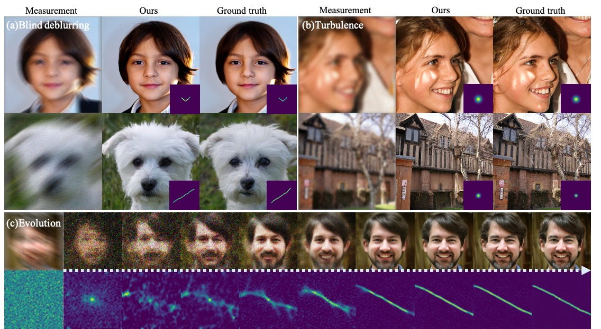

# Parallel Diffusion Model of Operator and Image for Blind Inverse Problems




## Abstract
Diffusion model-based inverse problem solvers have demonstrated state-of-the-art performance in cases where the forward operator is known (i.e. non-blind). However, the applicability of the method to blind inverse problems has yet to be explored. 
In this work, we show that we can indeed solve a family of blind inverse problems by constructing another diffusion prior for the forward operator. Specifically, parallel reverse diffusion guided by gradients from the intermediate stages enables joint optimization of both the forward operator parameters as well as the image, such that both are jointly estimated at the end of the parallel reverse diffusion procedure. We show the efficacy of our method on two representative tasks --- blind deblurring, and imaging through turbulence --- and show that our method yields state-of-the-art performance, while also being flexible to be applicable to general blind inverse problems when we know the functional forms.


## Prerequisites
- python 3.8

- pytorch 1.11.0

- CUDA 11.3.1

- nvidia-docker (if you use GPU in docker container)

## Getting started 

### 1) Clone the repository

```
git clone https://github.com/BlindDPS/blind-dps

cd blind-dps
```


### 2) Download pretrained checkpoint
From the [link](https://drive.google.com/drive/folders/1K_CG24xePSGeSdTGmcPfOAliHdY-nUsC?usp=sharing), download all checkpoints and paste it to ./models/
```
mkdir models
mv {DOWNLOAD_DIR}/ffqh_10m.pt ./models/
mv {DOWNLOAD_DIR}/kernel_new_3m.pt ./models/
mv {DOWNLOAD_DIR}/tilt256x256_1.4m.pt ./models/
```


### 3) Set environment
### [Option 1] Local environment setting

We use the external codes for motion-blurring and non-linear deblurring.

```
git clone https://github.com/VinAIResearch/blur-kernel-space-exploring bkse

git clone https://github.com/LeviBorodenko/motionblur motionblur
```

Install dependencies

```
conda create -n BlindDPS python=3.8

conda activate BlindDPS

pip install -r requirements.txt

pip install torch==1.11.0+cu113 torchvision==0.12.0+cu113 torchaudio==0.11.0 --extra-index-url https://download.pytorch.org/whl/cu113
```

### [Option 2] Build Docker image

Install docker engine, GPU driver and proper cuda before running the following commands.

Dockerfile already contains command to clone external codes. You don't have to clone them again.

--gpus=all is required to use local GPU device (Docker >= 19.03)

```
docker build -t blind-dps-docker:latest .

docker run -it --rm --gpus=all blind-dps-docker
```


### 4) Inference

```
# Blind deblurring (motion)

$ bash run_deblur.sh

# Imaging through turbulence

$ bash run_turbulence.sh

```

## Possible task configurations

```
- configs/gaussian_deblur_config.yaml
- configs/motion_deblur_config.yaml
- configs/turbulence_config.yaml
```

### Structure of task configurations
You need to write your data directory at data.root. Default is ./data/samples which contains three sample images from FFHQ validation set.

```
kernel: gaussian # or motion
kernel_size: 64
intensity: 3.0 # 0.5 for motion

conditioning:
    method: ps
    params:
        scale: 0.3

data:
    name: ffhq
    root: ./data/samples/

measurement:
    operator:
        name: blind_blur
noise:
    name:   gaussian
    sigma:  0.02
```
